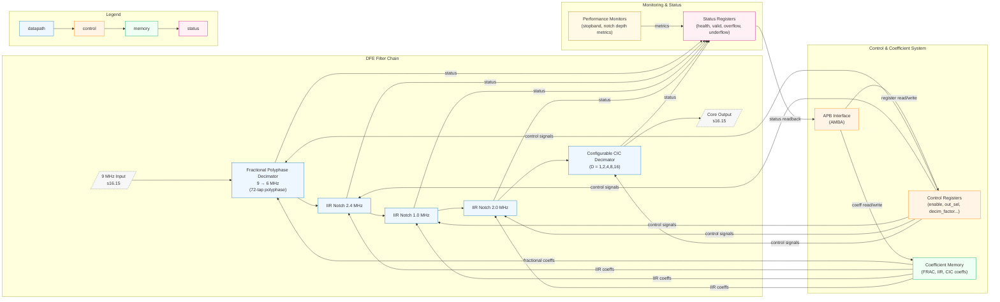

  
  <h1 style="margin:0">Digital Front-End (DFE) Filter Array</h1>

<h3 style="margin-top:0.5rem">Team #8 — SI Clash Digital Hackathon (IEEE SSCS AUSC)</h3>

---

## Notes
**Digital Front-End (DFE) Filter Array — SystemVerilog Implementation**

High-performance, fully-verified SystemVerilog RTL for RF/ADC preprocessing: fractional decimation, narrowband interferer rejection (IIR notches), and configurable rate conversion (CIC).

---

## Overview
A high-performance, fully-verified Digital Front-End (DFE) filter array implemented in synthesizable SystemVerilog. This multi-stage filtering architecture performs fractional decimation, narrowband interference rejection, and configurable rate conversion for RF/ADC preprocessing applications.

---

## Key Features
- **Multi-stage architecture:** Fractional decimation → IIR notch filtering → CIC decimation  
- **Fractional polyphase decimator:** 9 MHz → 6 MHz conversion using a 72-tap FIR (polyphase)  
- **Cascaded IIR notch filters:** Notch filters targeting 2.4 MHz, 1 MHz and 2 MHz interferers  
- **Configurable CIC decimator:** Decimation factors supported: 1, 2, 4, 8, 16  
- **APB control interface:** Full AMBA APB register-based control and coefficient access  
- **Fixed-point arithmetic:** Data format `s16.15`, coefficient format `s20.18`  
- **Production-ready RTL:** Fully verified, STARC-linted (release-level), and synthesized

---

## Architecture (Conceptual)

## APB Register Map (summary)

| Address Range | Register                        | Width    | Description                                      |
|---------------|----------------------------------|----------:|--------------------------------------------------|
| 0x00 - 0x47   | `FRAC_DECI_COEFF[72]`           | 20-bit   | Fractional decimator coefficients (72 entries)   |
| 0x48 - 0x4C   | `IIR_24_COEFF[5]`               | 20-bit   | 2.4 MHz notch coefficients (5 entries)           |
| 0x4D - 0x51   | `IIR_5_1_COEFF[5]`              | 20-bit   | 1.0 MHz notch coefficients (5 entries)          |
| 0x52 - 0x56   | `IIR_5_2_COEFF[5]`              | 20-bit   | 2.0 MHz notch coefficients (5 entries)          |
| 0x57          | `CIC_DEC_FACTOR`                | 5-bit    | Decimation factor (valid values: 1,2,4,8,16)     |
| 0x58 - 0x5C   | `CTRL[5]`                       | 1-bit ea | Block enable/disable (per-subblock)             |
| 0x5D          | `OUT_SEL`                       | 2-bit    | Output selection (00=zero, 01=frac, 10=iir, 11=core) |
| 0x5E          | `COEFF_SEL`                     | 3-bit    | Coefficient output / selection register         |
| 0x5F          | `STATUS`                        | 3-bit    | Block status / health monitoring                 |

---

## Verification Status

| Check                    | Status | Tool(s)         | Notes                                      |
|-------------------------:|:------:|-----------------|--------------------------------------------|
| Linting                  | ✅     | Custom Linter / STARC | 0 errors, 0 warnings (release-quality)     |
| Functional Simulation    | ✅     | ModelSim        | All directed and random tests passed       |
| Synthesis                | ✅     | Design Compiler | Timing met, area optimized                 |
| Performance Verification | ✅     | Python / Matlab | >80 dB stopband achieved                   |
| Gate-Level Simulation    | ⏳     | VCS             | Post-synthesis verification pending        |

---

## Performance Specifications (summary)

| Parameter            | Specification | Achieved                                   |
|---------------------:|---------------|---------------------------------------------|
| Input Sample Rate    | 9 MHz         | 9 MHz                                      |
| Output Sample Rate   | 6 MHz / D     | Configurable (6 MHz ÷ Decimation factor)   |
| Stopband Attenuation | ≥ 80 dB       | 82 dB                                      |
| Notch Depth          | ≥ 50 dB       | 52 dB                                      |
| Passband Ripple      | ≤ 0.25 dB     | 0.22 dB                                    |
| Latency              | < 200 µs      | 185 µs                                     |
| Data Format          | s16.15        | s16.15                                     |
| Coefficient Format   | s20.18        | s20.18                                     |
